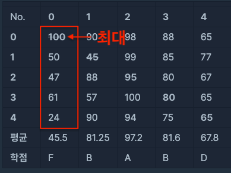
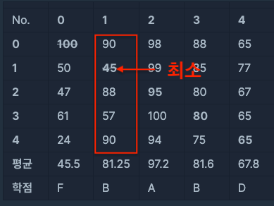
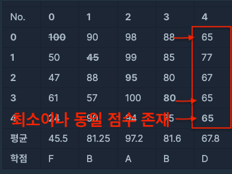
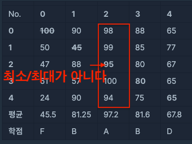

# \[ALGORITHM\] 상호 평가

## 문제

이 문서에서 다룰 문제 "상호 평가"는 "프로그래머스 > 코딩테스트 연습 > 위클리 챌린지 > 2주차" 문제이다. 문제 링크는 다음과 같다.

* [https://programmers.co.kr/learn/courses/30/lessons/83201](https://programmers.co.kr/learn/courses/30/lessons/83201)


## 문제 풀이

문제의 입력은 다음과 같다.

* scores [][]int (n x n의 2차원 배열)

문제를 간추리면 다음과 같다.

* n 명의 학생은 자신을 포함한 나머지 학생들에 대해 성적을 매길 수 있다.
* 자신이 채점한 점수가 최대 혹은 최소이고, 자신의 점수를 자신과 동일하게 채점한 사람이 없다면, 평균을 구할 때 제외한다.
* 각 구한 평균은 다음 학점으로 환산할 수 있다.
  ```
  90점 이상: A
  80점 이상 90점 미만:	B
  70점 이상 80점 미만:	C
  50점 이상 70점 미만:	D
  50점 미만: F
  ```

첫 번째 예시를 보자.



0번 학생에 대한 5명의 학생들의 채점 결과는 다음과 같다.

```
0 -> 0 : 100 (최고점)
1 -> 0 : 50
2 -> 0 : 47
3 -> 0 : 61
4 -> 0 : 24
```

이 때, 0번 학생 본인이 채점한 점수가 최대 점수이며, 동일한 채점 결과가 없기 때문에, 평균을 구하는 식은 다음과 같다.

```
# 자신이 채점한 결과가 제외된다.
average = (50 + 47 + 61 + 24) / (5 - 1) = 45.5 
```

따라서 0번 학생의 학점은 다음과 같다.

```
result = F
```

이제 두 번째 예시를 보자.



1번 학생에 대한 5명의 학생들의 채점 결과는 다음과 같다.

```
0 -> 1 : 90
1 -> 1 : 45 (최소)
2 -> 1 : 88
3 -> 1 : 57 
4 -> 1 : 90
```

이 때, 1번 학생 본인이 채점한 점수가 최소 점수이며, 동일한 채점 결과가 없기 때문에, 평균을 구하는 식은 다음과 같다.

```
# 자신이 채점한 결과가 제외된다.
average = (90 + 88 + 57 + 90) / (5 - 1) = 81.25 
```

따라서 1번 학생의 학점은 다음과 같다.

```
result = B
```

이번엔 세 번째 예시를 보자.



4번 학생에 대한 5명의 학생들의 채점 결과는 다음과 같다.

```
0 -> 4 : 65 (최소)
1 -> 4 : 77
2 -> 4 : 67 
3 -> 4 : 65 (최소)
4 -> 4 : 65 (최소)
```

이 때, 4번 학생 본인이 채점한 점수가 최소 점수이며, 동일한 채점 결과가 2개 존재한다. 따라서 값을 계산할 때 제외되지 않는다. 즉 평균을 구하는 식은 다음과 같다.

```
average = (65 + 77 + 67 + 65 + 65) / 5 = 67.8 
```

따라서 4번 학생의 학점은 다음과 같다.

```
result = D
```

마지막 예시를 보자.



2번 학생에 대한 5명의 학생들의 채점 결과는 다음과 같다.

```
0 -> 2 : 98
1 -> 2 : 99
2 -> 2 : 95  (최소도 아니며 최대도 아니다.)
3 -> 2 : 100
4 -> 2 : 94
```

이 때, 2번 학생 본인이 채점한 점수는 최대 점수도 최소 점수도 아니다. 따라서 값을 계산할 때 제외되지 않는다. 즉 평균을 구하는 식은 다음과 같다.

```
average = (98 + 99 + 95 + 100 + 94) / 5 = 97.2 
```

따라서 2번 학생의 학점은 다음과 같다.

```
result = A
```

즉 다음과 같이 풀 수 있다.

1. 반환할 문자열 `result`에 대해서 0 - n-1번 학생에 대해서 다음을 계산한다.
   1. `i`번의 점수에 대한 5명의 채점 결과를 합친다.
   2. 다음 조건에 따라 평균을 계산한다.
      1. 만약 `i`번의 학생 본인이 채점한 점수가 최대 혹은 최소이면서 중복되는 점수가 없다면 평균 계산 시 제외한다.
         ```
         # myScore = i번 학생 본인이 채점한 점수
         (max == myScore || min == myScore) && sameCnt == 1
         ```
      2. 조건을 만족하지 않는다면, 일반적인 평균 계산을 한다.
   3. 평균을 구하면, 점수표에 따라 학점으로 변환한다.
   4. `result`에 이 학점을 합친다.
   
## 코드

코드는 크게 2가지 부분으로 나뉜다.

* 평균을 학점으로 나누는 부분
* 학생의 평균을 계산하는 부분 (평균 계산 후 학점으로 변환하면 된다.)

이를 생각하면서 코드를 짜면 된다. 코드는 다음과 같다.

solution.go
```go
func scorePointToGrade(score int) string {
	if score >= 90 {
		return "A"
	} else if score >= 80 {
		return "B"
	} else if score >= 70 {
		return "C"
	} else if score >= 50 {
		return "D"
	} else {
		return "F"
	}
}

func solution(scores [][]int) string {
	n := len(scores)
	result := ""

	for i := 0; i < n; i++ {
		myScore := scores[i][i]
		max := myScore
		min := myScore
        sum := 0
		sameCnt := 0

		for j := 0; j < n; j++ {
			score := scores[j][i]
			sum += score

			if max < score {
				max = score
			}

			if min > score {
				min = score
			}

			if myScore == score {
				sameCnt += 1
			}
		}

		average := 0

		if (max == myScore || min == myScore) && sameCnt == 1 {
			sum -= myScore
			average = sum / (n - 1)
		} else {
			average = sum / n
		}

		result += scorePointToGrade(average)
	}

	return result
}
```